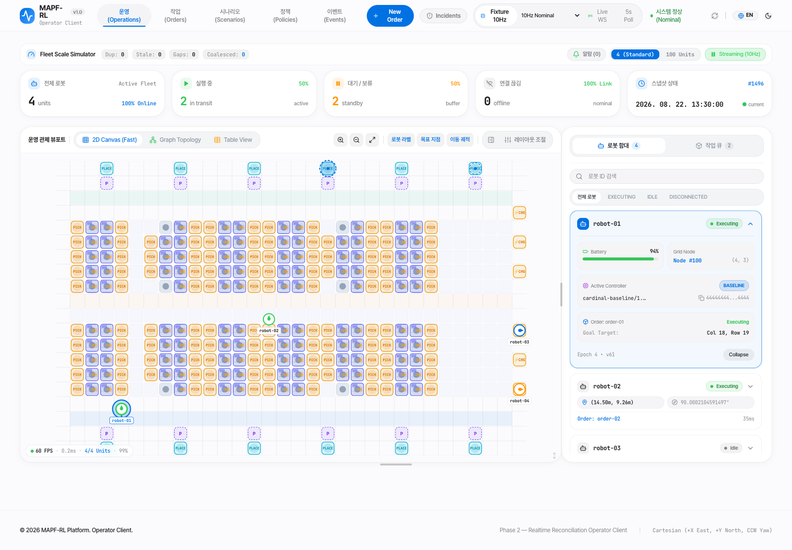

# MAPF-RL FE

```text
model-based Reinforcement Learning을 AGV, AMR 로봇의 path finding에 적용하는 repository입니다.
중앙 서버에서 제어하는 것보다 분산형으로 각각의 에이전트로서 MAPF를 풀어보고자 합니다.
현재, 산업용 로봇의 스펙 향상으로 충분히 가능하며, 강화학습의 결과인 policy는 단순 분포함수 이기 때문에 로봇 내부에서 큰 연산이 필요 없습니다.
어떻게 강화학습 환경을 구축해서 state, action의 space를 줄이고, transition probabilty를 어떤 함수로 계산할 것인지에 대한 아이디어는 비공개 입니다.
현재 아이디어 단계에 있고, 실증은 하지 못했습니다.
궁금하신 분은 jhpark@alumni.kaist.ac.kr로 연락 주시면 감사하겠습니다.
```

## 웹 화면

운영(Operations) 화면 — Fixture 10Hz 모드의 예시 데이터로 맵과 로봇 함대, 작업 큐를 표시한다.



## 전체 로컬 환경 실행 (Docker Compose)

파일 감시 없는 로컬 운영용 실행은 Infra의 `compose.production.yaml`을 함께 사용한다.
정적 FE 빌드를 Nginx로 제공하며 자세한 실행·복귀 방법은
[Infra README](../mapf-rl-infra/README.md#로컬-운영용-fe-파일-감시-없음)를 따른다.

Sibling 저장소가 같은 parent 아래 있고 Infra `.env`의 DB/Redis 설정이 준비되어 있으면:

```sh
cd ../mapf-rl-infra
docker compose up -d
scripts/smoke-test.sh
```

최초 실행은 이미지를 빌드하고 PostgreSQL/Redis health → Core migration·seed → API/Planner →
FE/Simulator 순서로 시작한다. 초기 빌드에는 네트워크 접근과 시간이 필요하다.
`http://127.0.0.1:5173`을 열면 로그인 없이 기본 **Live WS** 모드로 연결한다.
`warehouse-robot-1`이 준비되면 목표 **column 14, row 8**로 Order를 만든다.
시작은 **column 4, row 2**이며 재시작 후에는 저장된 checkpoint를 복원한다.

맵은 Fixture 10Hz와 같은 **32×20, 1m/cell 창고**다. Core의
`scripts/warehouse-map.json`이 원본이며 `scripts/contracts.py generate`/`check`가 FE JSON 복사본을
동기화/검사한다. Fixture의 가상 로봇·Order·이벤트는 Live 환경에 주입하지 않는다.
실제 Core Planner와 Simulator가 로봇 한 대를 운용한다.

코드 변경 후에는 `docker compose up -d --build`, 로그는
`docker compose logs --tail=100 core planner simulator fe`로 확인한다.
`docker compose stop` 또는 `docker compose down`은 데이터를 유지한다.
**`down --volumes`를 실행하지 않는다.** 기존 7×5 데모 상태도 그대로 보존한다.

DB/Redis는 Core 전용 네트워크에 있고 FE/Simulator는 별도 client 네트워크에서 Core에만 연결한다.
모든 host 포트는 `127.0.0.1`에 바인딩한다. 컨테이너용 local 인증도 Host/Origin/session/CSRF를
검증하며 `local` profile에서만 허용된다. 기본 client subnet은 `172.30.50.0/24`이며 충돌 시
Infra `.env`의 `MAPF_DEMO_SUBNET`을 변경한다. 이 구성은 운영 배포용이 아니다.

Pepper, Simulator credential, spool/checkpoint는 서로 구분된 named volume에 보존된다.
DB와 credential/pepper를 함께 유지해야 한다. 기존 파일을 지우거나 checkpoint를 삭제해 복구를
우회하지 않는다. API 재시작 후 로컬 browser session은 다음 snapshot 요청에서 자동 갱신된다.

MAPF-RL operator interface다. Core의 versioned REST/WebSocket contract만 사용하며 PostgreSQL이나
Redis에 직접 접근하지 않는다.

현재 React/Vite operator UI는 Fixture 10Hz와 Live WS 연결을 지원한다.
Core canonical contract의 generated TypeScript representation과 drift 검증을 포함한다. 상세 기준은 [FE 설계서](docs/DESIGN.md)와
[시스템 아키텍처](../mapf-rl-docs/ARCHITECTURE.md)를 따른다.

```bash
npm ci
npm run format:check
npm run typecheck
npm run contracts:check
npm test
```

### Robot-to-node commands

Select a connected, safe idle robot, then click a node in either Canvas or the
accessible list to open Yes/No confirmation inside the node inspector. Only Yes
submits an order; No preserves the robot and node information. Core's station catalog determines optional
PICK/PLACE/CHARGE actions; legacy Simulator capability cannot execute these actions.
Node clicks without a robot still inspect the node. The task queue displays server
progress and failures, and retries uncertain submissions with the same requestId.
New Order also uses the inline task queue form so the map remains visible.
Fixture mode supports movement previews; station actions require a supporting live Simulator.

### Local Live robot provisioning

로컬 Compose fleet runtime이 연결되면 로봇 목록의 **로봇 추가**에서 시작 셀을
좌표 입력 또는 지도 선택으로 지정할 수 있다. 정상 상태 보고 후 `READY`가 되면
snapshot을 갱신하고 새 로봇을 선택한다. 응답 유실에는 같은 `requestId`로 재시도하며,
실행 실패 사유는 화면에 남고 같은 로봇 ID로 재시도할 수 있다. Fixture·운영 환경,
삭제·자동 배차는 지원 범위에 포함되지 않는다. 인증 정보는 FE에 전달하지 않는다.

## 배터리 및 자동 충전

배터리 소모와 30% 이하 자동 충전을 지원한다. 진행 중인 작업은 완료한 뒤 충전하며 새 일반 작업은 제한한다. Core가 사용 가능한 충전소에 기존 CHARGE Order를 배정하고 Simulator가 80%까지 충전한다. 0%에서는 안전 정지하며 운영자 복구가 필요하다. 충전소가 없거나 점유 중이면 기다리고 재평가한다. 자세한 계약과 제한은 [Live WS 기능 현황](../mapf-rl-docs/LIVE-WS-CAPABILITIES.md#3-배터리-로직)을 참고한다.

### 거리 기반 자동 배차

Live `POST /api/v1/orders/auto-assign` (`auto-assignment 1.0.0`)은 가용 로봇의 Manhattan 거리 상위 최대 5대 중 A\* 경로 길이가 가장 짧은 로봇을 선택한다. 이동·PICK·PLACE·CHARGE를 지원하며 확정 robotId와 Order 결과를 반환한다. 같은 requestId로 재시도하고, 후보가 모두 도달 불가능하면 NO_ASSIGNABLE_ROBOT으로 실패한다. 선택된 작업은 기존 MAPF 예약을 거친다. Core → FE 순으로 적용하며 DB migration은 없다.

### 오더 큐와 운반 웨이브

Live 새 오더와 맵 노드 명령은 Core 큐에 등록한다. 로봇이 바쁘거나 연결이 끊겨 있어도 지정
작업을 등록할 수 있고, Core가 실행 직전에 가용성과 안전 상태를 검증한다. 오더 탭의
`운반 작업 / 웨이브`에서 PICK·PLACE station과 자동/지정 로봇을 선택한다. 행 하나는 운반 작업,
여러 행은 최대 100개 작업의 웨이브로 제출한다. 큐 상세에서 대기 사유, 단계, 실행 오더와
웨이브 완료·취소·보류 수를 확인할 수 있다. 화물이 남아 보류되면 같은 로봇의 PLACE 작업으로
복구한다. 불확실한 제출은 같은 requestId로 재시도한다. Fixture 모드에는 운반 웨이브를 제공하지 않는다.

### 일반 상태 telemetry

Core 소유 `telemetry 1.0.0` 계약과 `/ws/v1/telemetry` (`mapf.telemetry.v1`)를
`GET /api/v1/capabilities`로 협상한다. 일반 위치·배터리 보고는 200ms, 물리·안전 tick은
100ms다. 일반 보고는 별도 `telemetrySequence`, Redis TTL 15초, `PROJECTION` ACK를 사용하고
PostgreSQL 기록과 durable spool을 만들지 않는다. Redis 유실 후 최신 Simulator 보고로 복구한다.
주문·완료·취소·안전·station 전이는 선행 durable 상태 보고와 기존 ACK/spool을 유지한다.
telemetry 연결 단절 또는 3초 ACK 부재는 Simulator hold를 유발하며 최신 ACK와 기존 안전
조건 확인 후 재개한다. FE는 두 순번을 독립 관리하고 연결 유실 시 stale·snapshot 복구를 한다.
미지원 Core는 legacy DB 보고 경로를 사용하며 Redis 장애는 자동 fallback 사유가 아니다.
일반 상태 DB sampling은 없다. 이전 이미지·저장 볼륨은 배포와 rollback 시 보존한다.

### PLACE departure buffers

Core's buffer catalog is authoritative. The map and robot panels show reserved/occupied
berths and departure status from independent `BUFFER_STATE` snapshot/event entities.
Types are generated from Core's buffer schema; regenerate through Core's contracts script.
Deploy this consumer with the updated Core/Planner. `tests/buffers.test.mjs` checks
catalog validation, topology, duplicate handling and telemetry reconciliation.

### Passage waiting

Core-generated `TrafficWait` (`traffic-control 1.0.0`) is adapted from snapshots
and live robot reports. The robot inspector displays normal passage waiting and
blocking robot IDs while retaining `EXECUTING` / `WAIT`. A fresh report without the
field clears the wait. Motion preview times are explicitly estimates and do not
provide motion permission. Deploy with the matching Core and Simulator.

## 맵 렌더링 부하

격자·그래프 맵은 데이터, 선택, 레이어, 테마, 확대·이동 또는 화면 크기가
바뀔 때만 그리며 최대 30 FPS로 제한한다. 연속 갱신은 최신 상태로 합친다.
변화가 없으면 렌더링 예약을 종료하고, 숨겨진 탭에서는 그리기를 중단한다.
탭 복귀 시 최신 상태를 다시 그리며 통신·경고 처리는 계속 유지한다.
픽셀 배율에 따른 해상도는 유지하고 실제 정수 픽셀 크기가 바뀔 때만
캔버스 크기를 재설정한다. 격자 맵의 FPS는 실제 그린 횟수이며, 변화가
600ms 이상 없으면 `유휴`로 표시한다. 10Hz 데이터에서 10 FPS는 정상이다.

성능 비교는 동일 브라우저·화면 크기·픽셀 배율·맵·로봇 수에서 수행한다.
Fixture의 스트림 정지/재개로 정지·이동 조건을 맞추고 탭 숨김도 비교한다.
변화 없는 상태는 반복 그리기 0회, 이동은 최대 30 FPS, 숨김은 그리기 0회가
기준이다. 실제 GPU 사용률은 운영체제 계측으로 별도 측정해야 하며 FPS 감소를
GPU 절감률로 해석하지 않는다.

## Live 메가 맵

Core snapshot의 64×40 맵과 station/buffer catalog를 그대로 소비한다. Live selector는 실제 크기를
표시하며 fixture `mega-100`을 선택하지 않는다. 메가 맵·station·buffer JSON 복사본은 Core 계약 생성기로 관리한다.
로봇 추가 UI의 후보 셀은 참고 정보이며 Core 검증과 Simulator 안전 검사를 통과해야 생성이 완료된다.
현재 초기 10대만 기동하며 추가 90대의 Live 검증은 수행하지 않았다.

## Live 맵 드롭다운

같은 FE 주소에서 표준(32×20)·메가(64×40)를 선택한다. Core가 기존 맵의 Simulator·Planner·Retention을
정지한 뒤 대상 맵을 초기화하고 활성화한다. 한 번에 하나의 맵만 실행한다.

확인 창을 승인하면 **대상 맵의 오더·작업 이력·예약·적재·실행 상태를 삭제**한다.
맵별 등록 로봇(ID·설정·수동 추가·등록 위치)은 보존하며 초기 배터리·빈 적재 상태로 시작한다.
현재 맵 재선택은 아무 동작도 하지 않는다. 전환 중 화면 조작을 차단하며 완료 후 snapshot·스트림·캐시를 새로 연결한다.

Core 소유 계약은 `local-map-control 1.0.0`이며 consumer 타입은 계약 생성기로 관리한다.
전환 실패 시 정지 상태와 재시도 화면을 유지한다. 이전 환경 로그인 주소로 이동하는 기능은 제거했다.

맵 세대가 바뀌면 이전 요청·재시도 목록과 제출 잠금을 정리한다. 같은 맵으로 돌아와도 이전 세대의
요청은 재시도하지 않는다. 맵 제어 조회의 통신 오류에서는 화면과 Fixture 사용을 유지하고 Live 쓰기만
차단하며 자동으로 연결을 재확인한다. 맵 제어 조회는 5초 안에 응답하지 않으면 연결 오류로 처리한다.
