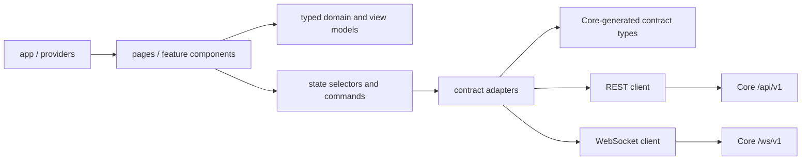
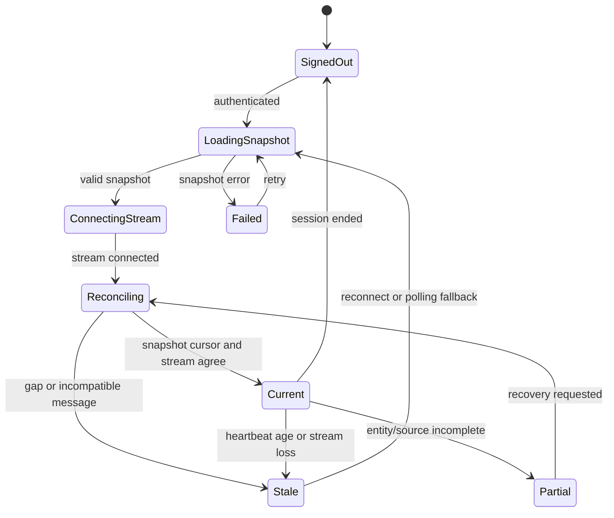
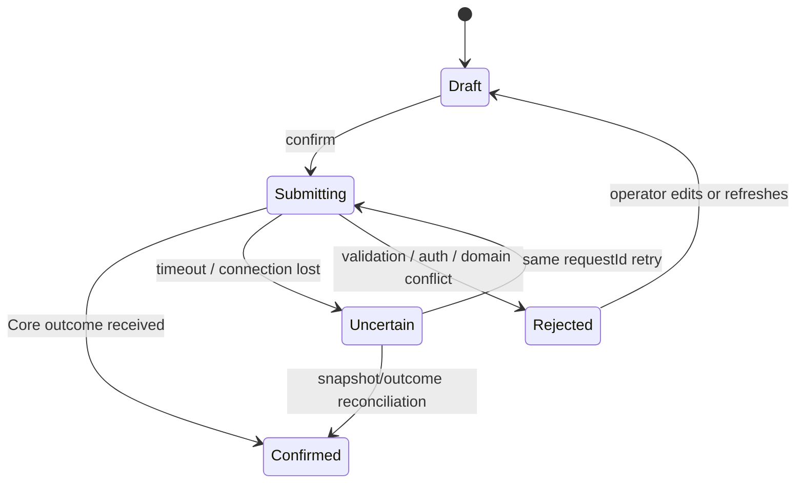

# MAPF-RL FE 설계서

> - 상태: Phase 0 contract consumer 기준선 v0.2
> - 대상 저장소: `mapf-rl-fe`
> - 기준일: 2026-08-22
> - 상위 기준: [`../../mapf-rl-docs/ARCHITECTURE.md`](../../mapf-rl-docs/ARCHITECTURE.md)
> - Core 대응 설계: [`../../mapf-rl-core/docs/DESIGN.md`](../../mapf-rl-core/docs/DESIGN.md)
> - Simulator 대응 설계: [`../../mapf-rl-simulator/docs/DESIGN.md`](../../mapf-rl-simulator/docs/DESIGN.md)
> - UI·기술 참조: [`../../../search-only-good-stock-fe/DESIGN.md`](../../../search-only-good-stock-fe/DESIGN.md)와 해당 구현
> - 구현 지침: [`../AGENTS.md`](../AGENTS.md)
> - 주의: 이 문서의 버전은 REST, WebSocket, observation, action, normalization, policy package의 계약 버전과 별개다.

## 1. 문서 목적과 판단 기준

이 문서는 시스템 아키텍처가 정한 FE 책임을 구현 가능한 제품·화면·상태·통신 구조로 구체화한다. `search-only-good-stock-fe`의 Apple식 시각 언어와 Vite 기반 React 구조를 그대로 계승하면서, MAPF 운영에 필요한 map·robot·Order·event·policy workflow와 실시간 복구 규칙을 정의한다.

현재 저장소에는 TypeScript contract consumer, `package.json`, lockfile과 drift test만 있다. React/Vite
application과 화면 runtime은 아직 없다. Core canonical endpoint와 wire field는 확정됐지만 구현된
화면이나 연결로 표현하지 않는다.

판단 표시는 다음과 같다.

| 표시 | 의미 |
|---|---|
| **확정 사항** | 상위 아키텍처, Core·Simulator 설계와 FE 지침이 요구하는 책임, 금지 조건 또는 불변 조건 |
| **확정 기본선** | 최초 구현과 운영에 적용하는 구체적인 선택. 변경 시 영향도에 따라 ADR과 contract version 변경이 필요 |
| **향후 확장** | 현재 기준선에는 포함하지 않으며 요구가 생기면 별도 계약과 검증을 거쳐 추가하는 기능 |

문서 간 충돌 시 적용 순서는 다음과 같다.

1. 워크스페이스 `AGENTS.md`
2. 현재 시스템 기준선인 `mapf-rl-docs/ARCHITECTURE.md`
3. FE 저장소 `AGENTS.md`
4. Core canonical contract와 `mapf-rl-core/docs/DESIGN.md`
5. Simulator 안전 경계와 `mapf-rl-simulator/docs/DESIGN.md`
6. 이 문서
7. 개별 ADR과 구현 문서

`search-only-good-stock-fe`는 UI와 frontend 구성의 참조일 뿐 MAPF 도메인 계약의 근거가 아니다. 두 문서가 충돌하면 MAPF 아키텍처와 Core canonical contract가 우선한다.

## 2. 목표, 비목표와 핵심 불변 조건

### 2.1 목표

FE는 다음을 제공한다.

- 현재 map, robot 위치·연결·freshness·safety 상태를 한눈에 파악하는 operator dashboard
- Order 생성·취소·재배정, replan과 허용된 instant action을 수행하는 감사 가능한 workflow
- collision risk, deadlock, fault, safety reject/stop과 reconciliation 실패를 지속적으로 확인·복구하는 incident workflow
- Core authoritative REST snapshot과 versioned WebSocket stream의 일관된 reconciliation
- Order application ack와 실제 execution state, desired policy와 reported active policy의 명확한 구분
- Policy package metadata, rollout 단계와 robot별 desired/staged/active/failed 분포의 운영 가시성
- OIDC Authorization Code + PKCE 기반 operator 인증과 권한별 UI
- 좌표·단위가 정확하고 대규모 telemetry에서도 bounded한 map rendering
- loading, empty, stale, disconnected, partial, permission과 failure 상태의 명시적 표현
- `search-only-good-stock-fe`와 동일 계열의 정제된 Apple-style visual system, light/dark theme와 한국어/영어 전환

### 2.2 비목표

FE는 다음을 소유하지 않는다.

- Order lifecycle, robot state, connectivity, plan 또는 policy deployment의 권위 있는 판정
- 전역 MAPF, replan 계산, reservation 또는 collision/deadlock의 최종 판정
- Simulator의 local inference, kinematics, deterministic safety와 emergency-stop latch
- PostgreSQL, Redis, object storage 또는 Core 내부 storage representation 접근
- Core canonical schema와 별개의 수기 wire contract 정의
- raw policy output, observation tensor나 policy package binary의 browser 실행·검증
- 브라우저에서 Simulator API key, DB credential, signing key 또는 사용자 token을 영속 보관하는 방식
- MQTT topic, broker와 QoS를 포함한 VDA5050 transport compliance

### 2.3 핵심 불변 조건

**확정 사항**

1. FE는 Core의 versioned REST `/api/v1`과 WebSocket `/ws/v1`만 사용한다.
2. FE는 Redis, PostgreSQL과 object storage credential에 접근하지 않는다.
3. Server-confirmed state와 local draft·pending intent를 분리한다. Optimistic UI가 robot, Order, safety 또는 policy의 확정 상태를 덮어쓰지 않는다.
4. WebSocket 도착 순서나 timestamp만으로 state를 확정하지 않는다. Stable identity, entity version, event cursor와 snapshot freshness를 사용한다.
5. 재연결 후 authoritative REST snapshot을 reconcile하기 전 live 화면을 `current`로 표시하지 않는다.
6. 모든 mutation은 client-generated UUIDv4 `requestId`를 사용한다. 결과가 불명확한 retry는 같은 operation과 같은 `requestId`를 유지한다.
7. `orderUpdateId`는 Core만 발급한다. FE는 stale·duplicate·gap을 보이거나 조정할 수 있지만 새 값을 만들거나 추측하지 않는다.
8. Application ack, activation ack와 actual execution state를 서로 다른 사실로 표시한다.
9. FE의 stop·release UI는 operator intent를 Core에 제출할 뿐 Simulator의 최종 safety authority를 대체하지 않는다.
10. Emergency-stop 해제는 local cause 해소와 권한 있는 audited command가 모두 필요함을 표시하며 단순 toggle로 구현하지 않는다.
11. Critical incident는 color 또는 transient toast에만 의존하지 않고 persistent incident surface와 text/icon/status를 함께 사용한다.
12. UTC wall-clock과 `simulationTimeMs`, world coordinate와 screen pixel, SI unit 변환을 명시적으로 구분한다.
13. Incompatible contract, malformed payload, partial snapshot과 unknown required semantics를 임의 default로 보정하지 않는다.
14. Browser bundle에 포함되는 환경 변수는 모두 public으로 취급한다.
15. FE는 Core가 제공한 actual state를 원하는 state로 덮어보이지 않는다. 특히 policy rollout 중 desired/staged/active/failed 상태를 분리한다.

## 3. 제품 경험과 Apple 디자인 원칙

`search-only-good-stock-fe`의 시각적 결과와 상호작용 감각을 MAPF operator domain에 맞춰 재사용한다. 단, 안전 정보의 인지성과 접근성이 장식적 일관성보다 우선한다.

### 3.1 Clarity

- 저가독성 neon gradient, 과도한 glow, 장식적 3D icon을 사용하지 않는다.
- 한 화면의 시각적 우선순위는 `critical safety → disconnected/stale → active execution → pending operator intent → history` 순이다.
- Robot ID, Order ID, version, 시간과 물리 수치는 `tabular-nums`를 사용해 위치가 흔들리지 않게 한다.
- `Applied`와 `Executing`, `Stopped`와 `Disconnected`, `Desired`와 `Active`처럼 운영상 다른 상태를 같은 label이나 color로 합치지 않는다.

### 3.2 Deference

- UI는 map과 operational data를 돋보이게 하는 중립적인 무대다.
- 52px frosted-glass top navigation, 24px radius Bento surface, 1px low-contrast border와 넉넉한 whitespace를 참조 FE와 동일 계열로 사용한다.
- Animation은 상태 변화의 원인과 위치를 설명할 때만 사용하며 continuously moving decorative effect는 사용하지 않는다.
- Robot이 많을 때 label·trail·secondary telemetry를 자동 축약하되 critical alert와 selected entity는 숨기지 않는다.

### 3.3 Depth

- Canvas, floating control dock, inspector drawer와 confirmation dialog를 명확한 elevation layer로 구분한다.
- Hover는 탐색 보조이며 중요한 정보는 hover 없이 접근할 수 있어야 한다.
- Drawer와 modal은 background context를 유지하지만 focus, keyboard order와 screen-reader dialog semantics를 보장한다.

### 3.4 Operational calm

- 정상 상태는 조용하고 밀도가 높으며, 문제 상태만 명확히 전면화한다.
- Critical alert에는 motion blur, flashing 또는 반복 bounce를 사용하지 않는다. Text, icon, border와 필요 시 절제된 pulse를 함께 사용한다.
- 경보를 닫는 동작과 incident를 해결·acknowledge하는 동작을 구분한다. UI dismissal이 Core incident 상태를 변경하지 않는다.

## 4. 정보 구조와 주요 화면

### 4.1 전역 navigation

참조 FE의 single-shell tab navigation을 계승한다.

| 전역 영역 | 목적 | 핵심 정보·작업 |
|---|---|---|
| `Operations` | 실시간 운영 | map, robot, active Order, incident, connectivity |
| `Orders` | 작업 관리 | 생성, 검색, lifecycle, cancel/reassign, history |
| `Scenarios` | simulation 실행·관찰 | scenario 선택, 실행 상태, 결과와 재현 metadata |
| `Policies` | package와 rollout 관찰·관리 | approval metadata, rollout 단계, robot별 deployment, rollback intent |
| `Events` | incident와 감사 탐색 | safety/fault/replan/auth event, filter, correlation |

권한이 없는 tab은 단순히 숨기는 것만으로 보안을 대신하지 않는다. Core authorization이 최종 기준이며, 사용자가 접근한 경우 permission state와 필요한 권한을 설명한다.

### 4.2 Operations dashboard

Desktop 기준 layout은 다음과 같다.

```text
┌──────────────────────────────────────────────────────────────────────────────┐
│ 52px glass nav │ Environment │ connection/freshness │ user/theme/language   │
├──────────────────────────────────────────────────────────────────────────────┤
│ Persistent incident strip: safety stop / collision risk / stale / gap       │
├──────────────────────────────────────────────────────┬───────────────────────┤
│                                                      │ Robot / Order         │
│ Map canvas                                           │ Inspector drawer      │
│ robots · routes · reservations · obstacles           │ state · versions      │
│                                                      │ actions · timeline    │
│ floating layer controls                              │                       │
├──────────────────────────────────────────────────────┴───────────────────────┤
│ Bento status rail: fleet · executing · held · disconnected · policy spread  │
└──────────────────────────────────────────────────────────────────────────────┘
```

Mobile에서는 map을 우선 유지하고 inspector는 bottom sheet로 전환한다. Critical incident strip은 접히더라도 active count와 최고 severity, disconnected/stale 여부를 계속 노출한다.

### 4.3 Entity inspector

선택 대상에 따라 같은 drawer shell 안에서 내용을 바꾼다.

- Robot: accepted pose/state, state age, connectivity, `sessionEpoch`, controller/policy, current Order, safety/fault, recent event
- Order: lifecycle, `orderUpdateId`, `planRevisionId`, assigned robot, application/execution 구분, transition timeline
- Incident: severity, reason, occurred-at UTC, simulation time, related entity/version, acknowledged/resolved state와 허용 action
- Policy deployment: desired/staged/active/failed identity, digest short form, compatibility, last transition과 failure reason

Inspector가 열린 동안에도 뒤의 live state는 갱신한다. 사용자가 form을 편집 중이면 server-confirmed 변경과 local draft conflict를 명시하고 자동으로 form을 덮어쓰지 않는다.

### 4.4 Order workflow

Order 생성 wizard의 기본 순서는 다음과 같다.

1. map version과 goal/target 선택
2. robot 또는 Core 자동 할당 조건 선택
3. route constraint와 입력 단위 확인
4. 최종 요약과 영향 확인
5. UUIDv4 `requestId`를 생성해 intent 제출
6. Core accepted/rejected outcome 표시
7. `Submitted → Planning → Dispatchable → Dispatched → Applied → Executing`을 각각 표시

Cancel, reassign과 instant action은 destructive/privileged action으로 취급한다. 대상, 현재 state/version과 예상 결과를 confirmation에 표시하고 submit 중 중복 실행을 막는다.

### 4.5 Policy rollout workflow

- Package lifecycle `Candidate → Verified → Approved → Withdrawn`과 robot deployment lifecycle을 별도 surface로 표시한다.
- Rollout은 `1 robot → 5% → 25% → 100%` 단계를 가진 progress control로 표시하되, FE가 다음 단계 진행 조건을 자체 판정하지 않는다.
- Robot별 desired, downloading, staged, active, rollback pending, rolled back, failed를 분리한다.
- Disconnected robot에는 마지막 reported active version과 desired version을 함께 표시한다.
- Approve, withdraw, rollback은 policy-manager 권한, evidence 확인과 confirmation을 요구한다.

## 5. Visual system

### 5.1 Color token

참조 FE의 Apple palette를 기본으로 하되 운영 상태 의미를 추가한다.

| Token | Light | Dark | 역할 |
|---|---:|---:|---|
| `--apple-canvas` | `#FBFBFD` | `#000000` | 전체 canvas |
| `--apple-surface` | `#FFFFFF` | `#1C1C1E` | Bento card, drawer, modal |
| `--apple-surface-subtle` | `#EBEBED` | `#2C2C2E` | segmented control, input, inactive chip |
| `--apple-border` | `rgba(0,0,0,.06)` | `rgba(255,255,255,.08)` | container border |
| `--apple-divider` | `rgba(0,0,0,.04)` | `rgba(255,255,255,.06)` | 내부 divider |
| `--apple-text-primary` | `#1D1D1F` | `#F5F5F7` | primary text |
| `--apple-text-secondary` | `#86868B` | `#A1A1A6` | secondary text |
| `--apple-text-tertiary` | `#A1A1A6` | `#6E6E73` | caption, disabled |
| `--apple-blue` | `#0071E3` | `#2997FF` | selection, primary action |
| `--status-ok` | `#248A3D` | `#30D158` | confirmed healthy/complete |
| `--status-warning` | `#B25000` | `#FF9F0A` | stale, held, degraded |
| `--status-critical` | `#D70015` | `#FF453A` | collision risk, emergency, failure |
| `--status-info` | `#0071E3` | `#64D2FF` | planning, staged, informational |
| `--status-neutral` | `#6E6E73` | `#98989D` | idle, cancelled, unknown |

Color mapping은 domain label과 icon을 항상 동반한다. `current/stale/partial/disconnected`와 severity는 서로 다른 차원이므로 하나의 color enum으로 합치지 않는다.

### 5.2 Typography

- 기본 font stack: `SF Pro Display`, `SF Pro Text`, `Pretendard`, `Inter`, `-apple-system`, `sans-serif`
- 숫자와 identifier: `JetBrains Mono`, `ui-monospace`, `tabular-nums`
- `Display`: 40/48, 700, letter spacing `-0.025em`
- `H1`: 28/36, 700, `-0.02em`
- `H2`: 20/28, 600, `-0.015em`
- `H3`: 16/24, 600, `-0.01em`
- `Body`: 14/20, 400, `-0.005em`
- `Caption`: 12/16, 500, `0.01em`

Robot와 Order identifier는 사람이 구분할 수 있는 prefix와 충분한 문자를 보여주며 전체 값은 copy action과 accessible label로 제공한다.

### 5.3 Shape, elevation과 motion

- Global nav: 52px, `backdrop-blur-xl`, 반투명 canvas, 1px divider
- Primary Bento card: 24px radius
- Compact control/card: 14~16px radius
- Segmented control과 status chip: pill radius
- Drawer width: desktop 360~420px, viewport와 content에 따라 responsive
- Motion duration: micro interaction 120~180ms, drawer 220~280ms
- Easing: `cubic-bezier(0.16, 1, 0.3, 1)`
- `prefers-reduced-motion`에서는 transform animation과 pulse를 제거한다.

## 6. Frontend 기술 기준선

### 6.1 Toolchain

**확정 기본선**

`search-only-good-stock-fe`와 동일한 최초 toolchain 계열을 사용한다.

| 영역 | 기준선 | 선택 이유 |
|---|---|---|
| Build | Vite 6 | 참조 FE와 같은 SPA build/dev model |
| UI | React 18, React DOM 18 | 참조 FE와 같은 component model |
| Language | TypeScript 5.7 strict mode | contract와 domain/view model 경계 |
| Styling | Tailwind CSS 3.4 + CSS custom properties | 참조 FE의 token과 utility pattern 재사용 |
| Icon | `lucide-react` | 단순하고 일관된 outline icon |
| Chart | `recharts` | scenario/metric trend와 참조 FE 일치 |
| Utility | `clsx`, `tailwind-merge` | conditional class와 conflict 정리 |
| Package manager | npm + committed `package-lock.json` | 참조 FE와 동일하고 현재 workspace에 다른 기준 없음 |

Version은 scaffold 시 참조 repository lockfile을 기준으로 재현 가능하게 고정하고, 보안·호환성 검토 없이 최신 major로 암묵적 변경하지 않는다. 실제 dependency 추가는 구현 PR에서 별도로 검토한다.

초기에는 별도 UI component library를 추가하지 않고 design token과 작은 headless primitive를 소유한다. Router, server-state library와 OIDC client library는 22절의 결정 전 임의로 추가하지 않는다.

### 6.2 목표 source 구조

```text
src/
├── app/
│   ├── App.tsx
│   ├── providers/
│   └── navigation/
├── components/
│   ├── common/
│   ├── map/
│   ├── orders/
│   ├── robots/
│   ├── incidents/
│   ├── policies/
│   └── scenarios/
├── pages/
│   ├── OperationsPage.tsx
│   ├── OrdersPage.tsx
│   ├── ScenariosPage.tsx
│   ├── PoliciesPage.tsx
│   └── EventsPage.tsx
├── contracts/
│   ├── generated/
│   ├── fixtures/
│   └── adapters/
├── domain/
│   ├── order/
│   ├── robot/
│   ├── event/
│   ├── map/
│   └── policy/
├── services/
│   ├── api/
│   ├── auth/
│   ├── websocket/
│   └── observability/
├── state/
│   ├── entities/
│   ├── connection/
│   ├── reconciliation/
│   └── mutations/
├── hooks/
├── utils/
│   ├── coordinates/
│   ├── units/
│   ├── time/
│   └── ids/
├── locales/
├── styles/
│   ├── tokens.css
│   └── index.css
└── test/
    ├── fixtures/
    └── harness/
```

빈 directory와 placeholder를 한 번에 만들지 않는다. 각 구현 phase의 vertical slice에 필요한 module과 test를 함께 추가한다.

### 6.3 의존성 방향



**확정 사항**

- Component가 `fetch`, WebSocket frame parsing 또는 generated DTO를 직접 다루지 않는다.
- Generated contract representation은 수정하지 않고 adapter에서 domain/view model로 변환한다.
- Transport error를 feature별 문자열로 중복 변환하지 않고 RFC 9457 Problem Details adapter에서 정규화한다.
- Coordinate, unit과 time conversion은 named pure utility를 통과한다.
- Domain selector는 React rendering과 독립적으로 test할 수 있어야 한다.

## 7. Core contract boundary

### 7.1 계약 소유권

| 계약군 | Canonical owner | FE 역할 | FE 처리 |
|---|---|---|---|
| REST request/response/error | Core OpenAPI 3.1 | producer/consumer | generated representation + boundary adapter |
| WebSocket envelope/message | Core JSON Schema 2020-12 + fixture | event consumer | identity/version/type 검증 후 dispatch |
| Order/instant action | Core | intent producer, state consumer | local draft와 confirmed lifecycle 분리 |
| Map/version | Core | consumer | immutable identity/digest/frame/unit 검증 |
| Robot State/Event/Ack | Core contract | consumer | observed fact, accepted projection과 freshness 표시 |
| Plan revision/replan | Core contract | observer와 intent producer | `planRevisionId`, prepare/activation 결과 표시 |
| Policy package/rollout | Core | metadata consumer, authorized intent producer | package binary·secret 없이 lifecycle 표시 |
| Storage schema | Core 내부 | 역할 없음 | 접근·복제·추론 금지 |

**확정 기본선**

- 최초 public contract는 `1.0.0`이며 REST는 `/api/v1`, WebSocket은 `/ws/v1`이다.
- REST type은 Core `packages/contracts/openapi/openapi.json`, WS type은
  `packages/contracts/schemas/ws.schema.json`에서 생성해 repository에 commit한다.
- Core valid/invalid fixture를 FE에서도 실행한다.
- Unknown optional field는 같은 major 안에서 무시할 수 있다. Unknown required semantics, incompatible major/schema는 전체 message 또는 response를 거부하고 persistent incompatibility state를 표시한다.
- Core canonical schema에 endpoint나 field가 없으면 logical use case만 설계하고 wire name을 수작업으로 만들지 않는다.

### 7.2 REST와 WebSocket 역할

| Transport | FE 용도 | 금지·제한 |
|---|---|---|
| REST | mutation intent, authoritative snapshot, query/history, reconciliation | 실시간 stream을 정상 상태에서 polling으로 중복 구현 금지 |
| WebSocket | order/state/event/connectivity/policy 변화 수신 | exactly-once·완전 순서 가정, mutation success 추정 금지 |

- Resume cursor는 Core가 발급한 단조 증가 event sequence를 사용한다.
- Replay는 최근 15분 또는 10,000건 중 먼저 도달하는 범위다.
- Replay 범위를 벗어난 gap은 silent skip하지 않고 REST snapshot reconciliation으로 전환한다.
- WebSocket을 사용할 수 없을 때만 5초 간격 REST polling을 허용한다.
- Single WebSocket message 최대 1 MiB와 bounded client queue를 적용한다.

### 7.3 Boundary validation

Inbound data는 다음 순서를 통과한 뒤에만 화면 state가 된다.

```text
transport/status/frame validation
  -> authentication/session result validation
  -> schema/type/version validation
  -> stable message and producer identity validation
  -> entity/map/order/plan version validation
  -> unit/range/finite validation
  -> message-specific semantic validation
  -> typed domain/view model mapping
  -> reconciliation reducer
```

Validation 실패는 partial payload 적용이나 silent default로 복구하지 않는다. Replaceable projection 하나가 잘못된 경우 해당 entity를 stale/invalid로 격리하고, stream continuity 자체를 증명할 수 없으면 전체 connection을 reconciling 상태로 전환한다.

### 7.4 오류 모델

RFC 9457 Problem Details를 다음 normalized error로 변환한다.

| 범주 | UI 동작 | 자동 retry |
|---|---|---|
| validation | field와 원인 표시, draft 유지 | 수정 전 금지 |
| authentication | sign-in/session recovery 안내 | 인증 흐름 외 금지 |
| authorization | 권한 부족과 필요한 role 표시 | 금지 |
| idempotency conflict | 같은 `requestId`의 payload 충돌 명시 | 금지 |
| stale/gap | mutation 중지, snapshot reconcile | reconcile 후 판단 |
| dependency unavailable | persistent degraded + retry 상태 | 동일 `requestId`, bounded |
| domain conflict | 최신 state/version 표시 후 새 intent 요구 | 자동 금지 |
| incompatible contract | 기능 차단, 지원 version 표시 | 배포/contract 수정 전 금지 |

Server message를 그대로 `innerHTML`로 렌더링하지 않는다. Secret-bearing header, token과 payload를 telemetry나 error detail에 포함하지 않는다.

## 8. State model과 snapshot-stream reconciliation

### 8.1 상태 계층

FE state는 다음을 분리한다.

| 계층 | 예시 | 권위 |
|---|---|---|
| Confirmed entity | Robot, Order, MapVersion, Incident, Policy deployment | Core response/accepted stream |
| Freshness/connection | current, stale, partial, disconnected, reconciling | Core metadata + client connection state |
| Pending mutation | requestId, submitted payload digest, attempt, uncertain outcome | FE가 추적하되 결과는 Core가 확정 |
| Local draft | form input, filter, selection, drawer state | FE local |
| Presentation preference | theme, language, map layer, density | FE local persistence 가능 |

Confirmed entity를 pending mutation 결과로 미리 전이하지 않는다. 예를 들어 cancel submit 직후 `Cancelled`로 보이지 않고 `cancel 요청 확인 중`과 마지막 confirmed state를 함께 표시한다.

### 8.2 Connection lifecycle



`connected`는 `current`와 동의어가 아니다. Socket이 열려도 snapshot cursor, contract와 entity version reconciliation이 끝나지 않으면 `Reconciling`으로 표시한다.

### 8.3 Reconciliation algorithm

**확정 기본선**

1. Stream 연결 전 authoritative snapshot과 snapshot cursor/freshness metadata를 요청한다.
2. Snapshot 요청 중 도착한 stream event는 bounded buffer에 stable identity와 cursor 순으로 보관한다.
3. Snapshot schema와 contract version을 검증하고 confirmed store를 원자적으로 교체한다.
4. Snapshot cursor보다 큰 buffered event만 stable cursor 순으로 적용한다.
5. 같은 message identity duplicate는 no-op한다.
6. Entity version이 작은 event는 stale로 기록하고 적용하지 않는다.
7. 같은 entity version과 같은 content identity는 duplicate no-op한다.
8. 같은 version과 다른 content 또는 cursor/entity gap은 적용을 중단하고 `Reconciling`으로 전환한다.
9. Buffer overflow, replay window 초과나 partial snapshot이면 current 판정을 금지하고 새 REST snapshot을 요청한다.
10. Snapshot과 stream continuity가 확인된 뒤에만 `Current`로 전환한다.

Robot 10 Hz projection은 같은 robot의 replaceable state에 한해 최신 confirmed version으로 coalesce할 수 있다. Order transition, ack, incident, plan revision과 policy lifecycle event는 임의 drop·coalesce하지 않는다.

### 8.4 `orderUpdateId` 표시 규칙

- 첫 value `0`, 이후 strictly consecutive 증가라는 Core 기준을 사용한다.
- 작은 value는 stale indicator/diagnostic count만 남기고 current Order를 되돌리지 않는다.
- 같은 value·같은 content는 duplicate로 처리한다.
- 같은 value·다른 content는 contract incident로 표시하고 해당 Order action을 잠근다.
- Gap은 FE가 값을 채우지 않고 snapshot reconciliation을 시작한다.
- `Applied`는 Simulator application ack, `Executing`은 별도 runtime report라는 설명을 timeline에 유지한다.

## 9. Mutation과 operator action

### 9.1 공통 mutation state machine



Mutation별로 다음을 보존한다.

- UUIDv4 `requestId`
- authenticated principal과 logical operation scope
- validation/default 적용 후 제출 payload의 client-side stable identity
- attempt count, submitted-at UTC, last transport result
- Core outcome과 related entity/version

FE의 payload identity는 UX conflict 탐지 보조이며 Core의 RFC 8785 JCS + SHA-256 멱등 판정을 대체하지 않는다.

### 9.2 Retry

- Retryable dependency failure만 full-jitter exponential backoff로 250ms부터 30초 상한, 최대 5회 재시도한다.
- Mutation retry는 같은 `requestId`를 유지한다.
- Validation, authentication/authorization, contract incompatibility, idempotency conflict와 domain conflict는 자동 retry하지 않는다.
- `Retry-After`가 있는 경우 server 지시를 존중한다.
- Retry budget 소진 후 실패를 success로 추정하지 않고 uncertain/persistent failure로 남긴다.

### 9.3 Destructive·privileged action

다음은 confirmation, duplicate prevention, permission과 audit context를 요구한다.

- Order cancel/reassign
- instant action과 replan request
- emergency-stop release
- policy approve/withdraw/rollback과 rollout 단계 변경
- map activation 또는 운영 설정 변경이 향후 FE에 포함될 경우

Confirmation은 action 명, 대상, last confirmed state/version, 영향 범위와 되돌릴 수 있는지를 plain text로 제공한다. Emergency-stop release는 원인 해소 여부가 server-confirmed가 아니면 submit을 차단하거나 Core의 명시적 rejection을 그대로 표시한다.

## 10. 인증, 인가와 client 설정

### 10.1 Operator 인증

**확정 사항**

- Core OIDC BFF가 Authorization Code + PKCE를 수행하고 JWT access/refresh token은 server-side
  encrypted session에만 둔다.
- Core가 role과 scope를 판정하며 FE 조건부 rendering은 보안 경계가 아니다.
- Raw token을 `localStorage`, URL, query parameter, log, analytics payload나 error report에 저장하지 않는다.
- Sign-out, expiry와 authorization failure는 pending mutation과 stream을 안전하게 종료한다.
- Simulator `X-API-Key`는 FE contract, environment, bundle과 화면에 절대 포함하지 않는다.

Browser에는 `Secure`, `HttpOnly`, `SameSite=Strict`, `Path=/`, no-domain의
`__Host-mapf_session` cookie만 둔다. FE와 Core는 same-origin이며 cookie mutation은 session-bound
`X-CSRF-Token`을 요구한다. Native WebSocket은 cookie를 자동 전달하고 Core는 exact `Origin`
allowlist, session expiry/scope와 `Sec-WebSocket-Protocol: mapf.v1`을 검증한다. URL/query,
subprotocol 또는 message payload token은 금지한다. Cross-origin direct connection은 v1에서
지원하지 않는다.

### 10.2 Authorization UX

- Navigation visibility, button enabled state와 Core response를 함께 사용한다.
- Permission denied는 generic failure와 구분해 필요한 권한과 읽기 가능한 현재 상태를 제공한다.
- 권한 갱신·만료가 발생하면 기존 화면을 privileged current session처럼 유지하지 않는다.
- Audit 대상 action은 actor, target과 operation을 confirmation에 명확히 보여준다.

### 10.3 Public environment

선택한 Vite convention에 따라 다음과 같은 non-secret setting만 허용한다. 정확한 변수명은 scaffold 시 문서화한다.

- Core public base URL
- OIDC issuer/client ID/redirect URI처럼 공개 가능한 client metadata
- public environment label
- non-secret feature flag와 observability public endpoint/config

실제 `.env`, `.env.*`는 Git에서 제외하고 값 없는 `.env.example`만 commit한다. `local`은 loopback HTTP/WS를 허용하되 인증을 우회하지 않으며 `dev`/`production`은 HTTPS/WSS를 사용한다.

## 11. Map visualization과 좌표·단위

### 11.1 Coordinate boundary

Wire 기준은 다음과 같다.

- SI: `m`, `m/s`, `m/s²`, `rad`, `rad/s`, `s`
- 오른손 Cartesian world frame
- `+x`: 동/오른쪽, `+y`: 북/위쪽, `+z`: 위쪽
- Yaw: `+x` 기준 반시계 방향 radian
- Grid: column `+x`, row `+y`
- Cell center: `(column + 0.5, row + 0.5) × resolutionMeters` + map origin

Screen은 일반적으로 y가 아래로 증가하므로 world→screen 변환에서 y inversion을 named matrix/utility로 한 번만 적용한다. Rotation, pan, zoom, device pixel ratio와 viewport fit은 같은 transform object를 공유한다. Component가 독립적으로 `x * scale` 또는 degree/radian 변환을 수행하지 않는다.

### 11.2 Map version

- Map은 UUID, monotonic revision, SHA-256 content digest와 frame/unit metadata를 함께 표시·검증한다.
- Active Order와 Robot state의 map version이 현재 canvas와 다르면 overlay를 합성하지 않고 mismatch를 명시한다.
- Map 변경 중 local selection과 screen transform은 유지할 수 있지만 entity coordinate는 새 snapshot 검증 후 교체한다.

### 11.3 Rendering layer

Layer 순서는 다음을 기본으로 한다.

1. grid/topology와 static obstacle
2. reservation/allowed route
3. dynamic obstacle와 risk region
4. robot footprint, heading와 motion state
5. selected route/goal
6. incident marker와 focus ring
7. interaction hit area와 label

Static layer와 dynamic robot layer를 분리한다. 10 Hz robot update 하나가 page 전체나 static map을 rerender하지 않도록 keyed entity selector, memoized geometry와 animation frame batching을 사용한다. 최적화 기법은 representative robot count로 측정한 뒤 추가한다.

### 11.4 Interaction

- Wheel/pinch zoom, pan, fit-to-fleet, fit-to-selection 제공
- Keyboard로 robot/order 목록을 탐색하고 선택 entity를 map에 focus 가능
- Hover 없이 click/focus inspector로 전체 정보 접근
- Layer visibility는 local preference지만 critical incident layer는 완전히 숨길 수 없음
- Reduced motion에서는 robot interpolation을 끄거나 최소화하고 confirmed sample 위치를 명확히 표시

## 12. Domain presentation 규칙

### 12.1 Order lifecycle

Contract `1.0.0`의 상태명은 그대로 사용한다.

`Submitted`, `Planning`, `Dispatchable`, `Dispatched`, `Applied`, `Executing`, `Replanning`, `Held`, `Cancelling`, `Completed`, `Cancelled`, `Rejected`

- `Completed`, `Cancelled`, `Rejected`는 terminal state로 표시한다.
- `Held`는 성공·실패 중 하나로 축약하지 않고 원인과 recovery action을 보여준다.
- Timeline에는 transition reason, actor, UTC, `orderUpdateId`, `planRevisionId`를 가능한 범위에서 연결한다.
- VDA5050 state를 별도 Core lifecycle처럼 FE에서 재해석하지 않는다.

### 12.2 Robot과 connectivity

Robot card는 최소 다음 차원을 분리한다.

- Operational state: idle/executing/held/stopped 등 Core contract 값
- Connectivity: connected/degraded/disconnected
- Freshness: current/stale/partial/unknown + state age
- Safety: normal/wait/controlled stop/emergency stop/reject/fault
- Controller: explicit baseline 또는 policy mode와 identity
- Active work: Order ID와 `orderUpdateId`

`Disconnected`를 곧바로 `Stopped`로 추정하지 않는다. Simulator가 timeout rule로 stop한다는 설계와 마지막 accepted report를 구분해 표시한다.

### 12.3 Incident

Persistent incident center는 다음을 지원한다.

- Severity와 category(safety, collision risk, deadlock, fault, connection, contract, auth, policy)
- Active/acknowledged/resolved 상태
- occurred-at UTC와 `simulationTimeMs` 구분
- related robot/order/map/policy/version
- reason code와 operator-readable description
- Core가 허용한 recovery action

Safety reject/stop, auth failure와 contract incompatibility는 toast만으로 소비하지 않는다.

### 12.4 Time presentation

- Exchanged wall-clock은 RFC 3339 UTC `Z` 원본을 보존한다.
- 기본 화면은 사용자 locale time을 표시할 수 있지만 tooltip/detail에 UTC를 함께 제공한다.
- Ordering은 timestamp로 설명하지 않고 version/sequence를 우선한다.
- Simulation time은 `T+hh:mm:ss.SSS`처럼 wall-clock과 다른 표기와 label을 사용한다.

## 13. Loading, degraded와 empty state

| 상태 | 표현 | 허용 action |
|---|---|---|
| Loading | skeleton + 현재 요청 대상 | 취소/뒤로가기 |
| Empty | 데이터 없음의 원인과 next action | 권한에 따른 create/filter reset |
| Stale | 마지막 갱신 age, warning icon/text | refresh/reconcile, destructive action 제한 |
| Disconnected | persistent banner, last confirmed UTC | reconnect, read-only last snapshot |
| Reconciling | snapshot/stream 조정 중, current 아님 | mutation 제한 |
| Partial | 누락 source/entity 범위 표시 | 영향받지 않은 read 가능, risky action 제한 |
| Permission | 필요한 권한과 현재 user context | sign-in/권한 요청 안내 |
| Failure | stable code, correlation/requestId, retryability | 규칙에 따른 retry |
| Incompatible | server/client version 표시 | 기능 차단과 upgrade 안내 |

Last snapshot은 참고용으로 볼 수 있지만 background, watermark와 timestamp로 stale임을 명확히 한다. Critical action은 state freshness와 permission prerequisite가 없으면 disabled reason을 제공한다.

## 14. Accessibility와 internationalization

### 14.1 Accessibility

- WCAG 2.2 AA를 최초 기준선으로 사용한다.
- Text contrast, focus indicator, target size와 keyboard order를 검증한다.
- Map canvas와 동일 정보를 제공하는 keyboard-accessible robot/order list를 유지한다.
- Status는 color 외 text, icon, shape 또는 pattern을 함께 사용한다.
- Live region은 critical state와 mutation outcome에 제한하고 10 Hz telemetry를 읽지 않는다.
- Dialog는 focus trap, initial focus, Escape/close semantics와 action label을 가진다.
- Reduced motion, 200% text zoom과 high contrast에서 critical workflow를 검증한다.

### 14.2 한국어·영어

참조 FE처럼 한국어를 기본으로 하고 영어 전환을 제공한다.

- Contract identifier, state code, unit와 version은 번역하지 않는다.
- Operator explanation, label과 help text만 locale catalog로 관리한다.
- Error code와 localized explanation을 분리한다.
- Layout은 번역 길이 증가를 허용하고 고정 폭 button text에 의존하지 않는다.
- Theme와 language preference만 local storage에 저장할 수 있다. Token과 operational entity snapshot은 저장하지 않는다.

## 15. Performance와 backpressure

### 15.1 Performance budget

초기 목표는 다음과 같다. 실제 robot 수와 map 복잡도는 Core/Simulator scenario 기준이 확정되면 측정값으로 조정한다.

- 10 Hz robot projection 수신 중 primary interaction p95 100ms 이내
- Map frame p95 16.7ms 목표, 저사양/대규모에서는 33.3ms degraded 목표
- Long task 50ms 이상을 개발/성능 test에서 추적
- Initial shell과 critical status를 우선 표시하고 history/chart는 지연 loading 가능
- Offscreen inspector/chart가 live entity store 전체를 subscribe하지 않게 함

### 15.2 Client queue와 overload

- 모든 event buffer와 retry queue는 bounded한다.
- Replaceable robot projection만 entity/version 기준 최신값으로 coalesce한다.
- Order transition, incident, ack, plan revision과 policy lifecycle은 drop하지 않는다.
- Critical message를 처리할 수 없거나 continuity를 증명하지 못하면 connection을 stale/reconciling으로 전환한다.
- Browser tab background throttling 후 foreground 복귀 시 animation을 따라잡지 않고 snapshot freshness를 재평가한다.

### 15.3 Rendering strategy

- Entity-normalized store와 fine-grained selector를 사용한다.
- High-frequency pose와 low-frequency detail/history를 다른 subscription으로 분리한다.
- `requestAnimationFrame`에서 latest confirmed pose를 batch render한다.
- Table/list는 실제 측정 후 virtualization을 도입한다.
- Memoization은 identity/version이 안정적인 adapter output을 기준으로 한다.

## 16. Observability와 privacy

### 16.1 Correlation

Client log, trace와 error report에는 가능한 범위에서 다음 context를 연결한다.

- `requestId`, message/event identity와 Core correlation identity
- `robotId`, `orderId`, `orderUpdateId`, `planRevisionId`
- map와 contract version
- policy identity/version의 non-secret metadata
- connection state, replay cursor와 reconciliation result
- wall-clock UTC와 필요한 경우 `simulationTimeMs`

High-cardinality identifier는 metric label이 아니라 trace/log context에 둔다.

### 16.2 Client metric

| 영역 | Metric 범주 |
|---|---|
| Navigation/UI | route/tab load, interaction latency, render error |
| REST | latency/error/retry, mutation uncertain outcome |
| WebSocket | connect/reconnect, message rate/size, buffer depth, gap |
| Reconciliation | duration, success/failure, snapshot fallback, stale duration |
| Contract | decode/version/validation error, duplicate/stale/conflict |
| Map | frame time, visible robot/layer count, dropped/coalesced projection |
| Workflow | Order submit outcome, confirmation abandon, permission denial |

### 16.3 Secret와 개인 정보

- Raw access/refresh token, Simulator API key, credential-bearing header와 environment dump를 기록하지 않는다.
- Full request/response body를 기본 telemetry로 보내지 않는다.
- Operator identity는 Core audit가 소유하며 FE analytics에는 필요한 최소 non-secret identity만 사용한다.
- Error boundary는 secret redaction 후 stable error code와 correlation을 제공한다.

## 17. 장애와 복구

| 장애 | FE 즉시 동작 | 복구 완료 조건 |
|---|---|---|
| Malformed/incompatible payload | 적용 거부, affected state invalid/stale | compatible snapshot/contract |
| Duplicate event | no-op + diagnostic | current version 유지 |
| Stale entity version | current state 유지 | 새 event 또는 snapshot |
| Conflicting duplicate/gap | mutation 제한, reconciling | authoritative snapshot continuity |
| WebSocket loss | disconnected/stale 표시 | reconnect + snapshot/stream reconcile |
| Replay window 초과 | buffered event 폐기, snapshot 요청 | 새 snapshot cursor와 stream 일치 |
| REST dependency failure | last state stale 표시, bounded retry | successful authoritative response |
| Mutation timeout | uncertain 표시, same `requestId` retry | stored Core outcome 확인 |
| Auth expiry | privileged UI 잠금, stream 종료 | OIDC session recovery와 새 snapshot |
| Permission change | action 차단, confirmed read 유지 가능 | 새 authorization context |
| Slow browser/queue overflow | replaceable projection coalesce, gap 시 stale | buffer 정상화 + reconciliation |
| Render error | feature error boundary, critical shell 유지 | isolated retry 또는 reload 후 snapshot |

Browser reload나 process restart 후 operational state를 local persistence에서 복원하지 않는다. 인증 후 Core snapshot을 다시 읽고 reconciliation한다. Theme, language와 안전하지 않은 presentation preference만 복원한다.

## 18. 테스트 전략

### 18.1 계층별 검증

| 계층 | 필수 검증 |
|---|---|
| Unit | coordinate/unit/time, UUID/request state, status mapping, selectors |
| Contract | Core valid/invalid fixture, required/optional/unknown version, RFC 9457 mapping |
| Reducer | duplicate/stale/conflicting/gap event, snapshot atomic replace, buffer overflow |
| Mutation | same `requestId` retry, uncertain outcome, duplicate click, domain conflict |
| Auth/config | PKCE callback, expiry, permission, public env, secret redaction |
| Component | loading/empty/stale/disconnected/partial/permission/failure/incompatible |
| Accessibility | keyboard, focus, dialog, live region, contrast, color-independent status |
| Map | world/screen round-trip, pan/zoom, map mismatch, large robot count |
| Integration | snapshot + stream, reconnect/replay, 5초 polling fallback, slow consumer |
| Workflow | Order create/cancel/reassign, incident recovery, E-stop release, policy rollout/rollback |
| Visual | light/dark, Korean/English, desktop/tablet/mobile, reduced motion |
| End-to-end | Core contract test environment에서 Order→Applied→Executing, replan, disconnect와 rollout |

### 18.2 필수 failure matrix

- Duplicate, delayed, reordered, missing WebSocket event
- Stale `orderUpdateId`, conflicting duplicate와 gap
- Snapshot 중 stream event, partial snapshot과 replay window 초과
- WebSocket disconnect 중 mutation timeout과 같은 `requestId` retry
- `Applied` 후 execution report 없음, `Executing` 후 safety stop
- Connected지만 stale, disconnected지만 마지막 reported active policy 존재
- Robot별 desired/staged/active/failed policy 혼재
- Unauthorized destructive action과 session expiry 중 confirmation
- 10 Hz large fleet projection과 hidden/background tab 복귀

### 18.3 Validation command

Scaffold 후 `package.json`에 실제 script가 존재하는 경우 다음 순서로 수행한다.

1. Formatter check
2. Type check
3. ESLint
4. Focused unit/contract/integration test
5. Production build
6. Representative viewport와 large-fleet visual/performance inspection

현재 `package.json`, lockfile과 test runner가 없으므로 구체 command를 발명하거나 실행 성공으로 보고하지 않는다.

## 19. Build, 배포와 contract rollout

### 19.1 Build와 runtime

- Build artifact는 static SPA asset이며 환경별 public config 주입 방식을 scaffold ADR에서 확정한다.
- Source map 공개, CSP, cache-control과 asset integrity 정책을 production 배포 전에 결정한다.
- Hashed asset은 immutable cache가 가능하지만 shell과 runtime config는 rollback 가능한 cache policy를 사용한다.
- Production은 HTTPS만 허용하며 Core origin/CORS와 OIDC redirect URI를 환경별 allowlist로 관리한다.
- Frontend bundle과 `.env`에 secret을 넣지 않는다.

### 19.2 외부 contract rollout

Core·Simulator 설계와 같은 순서를 사용한다.

1. Core가 새 schema/version을 backward-compatible하게 수용하고 구버전을 유지한다.
2. Contract fixture와 observability를 먼저 배포한다.
3. Simulator를 배포하고 compatibility, reconciliation, `Ready`와 active policy 분포를 확인한다.
4. FE를 배포하고 snapshot/reconnect/error behavior를 확인한다.
5. 필요한 policy를 `1 robot → 5% → 25% → 100%`로 canary 활성화한다.
6. Rollback window와 구 consumer 사용량을 확인한 뒤에만 old contract를 제거한다.

FE rollback은 Core가 유지한 previous major contract와 generated consumer representation을 사용한다. Unknown required semantics를 old FE가 조용히 무시하게 만들지 않는다.

## 20. 구현 단계

### Phase 0 — Tooling과 visual foundation

- [x] TypeScript/npm contract consumer scaffold와 실제 validation script
- [x] Core OpenAPI/JSON Schema generated consumer, lock과 fixture pipeline
- [x] OIDC BFF/HttpOnly-cookie WS auth ADR과 no-secret public config template
- [ ] Vite/React/Tailwind와 visual foundation은 production dependency 승인 뒤 read-only slice와 함께 추가

### Phase 1 — Read-only Operations vertical slice

- Authoritative map/robot/Order snapshot
- Static map + selected robot inspector
- current/stale/partial/disconnected 상태
- Coordinate/unit/time utility와 accessibility list alternative

### Phase 2 — Realtime reconciliation

- WebSocket lifecycle, cursor, bounded buffer와 reducer
- Duplicate/stale/conflicting/gap fixture
- Snapshot + stream reconciliation, reconnect와 5초 fallback polling
- 10 Hz robot rendering과 performance baseline

### Phase 3 — Order와 incident workflow

- Order create와 UUIDv4 `requestId`
- Cancel/reassign/instant action confirmation과 uncertain outcome
- Application ack와 execution state timeline
- Persistent safety/fault/deadlock/connectivity incident center

### Phase 4 — Scenario와 policy operations

- Scenario 실행·result·reproducibility metadata
- Package approval metadata와 rollout distribution
- Desired/staged/active/failed, withdrawal와 rollback workflow
- Permission/audit context와 disconnected robot 표시

### Phase 5 — 운영 경화

- Large fleet, slow consumer와 background tab behavior
- OTel client trace/metric, error boundary와 secret scan
- WCAG 2.2 AA, light/dark, Korean/English visual regression
- Contract rollout/rollback과 production security header 검증

각 phase는 사용하지 않는 전체 component tree를 미리 만들지 않고 동작하는 vertical slice와 focused test를 함께 추가한다.

## 21. 확정 기준선 검증 gate

| 영역 | 확정 기준선 | 필수 검증 |
|---|---|---|
| UI | 참조 FE의 Apple token, 52px glass nav, 24px Bento, light/dark, ko/en | viewport·theme·locale visual review |
| Toolchain | Vite 6, React 18, TS 5.7, Tailwind 3.4, npm | lockfile reproducibility, type/lint/build |
| REST/WS | `/api/v1`, `/ws/v1`, RFC 9457, 15분/10,000건 replay | Core fixture와 snapshot-gap recovery |
| Contract | OpenAPI 3.1, JSON Schema 2020-12, `1.0.0`, generated type commit | generation drift/round-trip |
| Reconciliation | stable identity/version/cursor, snapshot atomic replace | duplicate/stale/conflict/gap/overflow |
| Mutation | UUIDv4 `requestId`, uncertain outcome, bounded retry | same-ID retry와 double-submit |
| Order | consecutive `orderUpdateId`, ack/execution 분리 | lifecycle와 stale/duplicate/gap |
| Map/time | SI, UTC, `simulationTimeMs`, world/grid frame | conversion round-trip와 map mismatch |
| Auth | same-origin OIDC BFF, HttpOnly cookie, CSRF/Origin 검증, no browser token | expiry/permission/redaction/security review |
| Safety UX | persistent incident, color-independent status, audited release | keyboard/screen reader/destructive action |
| Telemetry | WS 10 Hz, bounded queue, projection-only coalescing | large fleet/slow consumer/background tab |
| Policy | package와 robot deployment lifecycle 분리, canary distribution | mixed fleet와 disconnected rollback state |
| Deployment | Core → Simulator → FE → policy canary | old/new consumer와 FE rollback |

## 22. 구현 전 결정이 필요한 항목

상위 문서가 아직 wire/product 세부를 확정하지 않은 항목이다. 구현 편의를 위해 FE에서 임의 확정하지 않는다.

| 항목 | 결정 owner | 완료 조건 |
|---|---|---|
| Phase 1 이후 mutation/incident/scenario endpoint와 message 확장 | Core canonical contract | 새 OpenAPI/JSON Schema와 valid/invalid fixture |
| Router 도입과 deep-link URL model | FE product ADR | reload/back/forward와 권한 route test |
| Server-state/reconciliation library 도입 여부 | FE architecture ADR | bundle/complexity와 custom ordering reducer 비교 |
| Runtime public config 주입 방식 | FE deployment ADR | environment별 rollback과 no-secret 검증 |
| Large fleet 목표 robot 수와 map size | Product/Core/Simulator performance 기준 | representative load fixture와 budget |
| Incident acknowledge/resolve 권한과 wire flow | Core domain contract + FE | audit, duplicate와 permission fixture |
| Scenario command/result wire contract | Core contract + FE | reproducibility metadata와 lifecycle fixture |
| CSP, trusted origins와 client observability backend | Deployment/security ADR | production header와 redaction test |
| 지원 browser와 device 범위 | Product/FE | compatibility matrix와 visual/performance gate |

이 결정이 external contract, security boundary 또는 producer/consumer에 영향을 주면 Core 설계와 `ARCHITECTURE.md`도 함께 갱신한다.

## 23. 설계 및 PR checklist

- [ ] 변경 책임 owner와 Core/Simulator/FE producer·consumer를 기록했다.
- [ ] FE가 Core의 versioned REST/WS만 사용하고 DB/object storage에 접근하지 않는다.
- [ ] Core canonical schema에서 TypeScript representation을 생성하거나 같은 fixture로 검증한다.
- [ ] Generated DTO, domain/view model과 component를 분리한다.
- [ ] Server-confirmed state, pending intent와 local draft를 구분한다.
- [ ] `requestId` retry와 `orderUpdateId` stale/duplicate/conflict/gap 규칙을 보존한다.
- [ ] WebSocket arrival order나 timestamp를 authority로 사용하지 않는다.
- [ ] Reconnect 후 snapshot/stream reconciliation 전 current로 표시하지 않는다.
- [ ] Application ack, activation ack와 actual execution을 분리한다.
- [ ] Desired/staged/active/failed policy state와 disconnected robot의 last report를 구분한다.
- [ ] Current/stale/partial/disconnected/reconciling/permission/failure를 명시한다.
- [ ] Critical incident를 toast나 color에만 의존하지 않는다.
- [ ] Operator action이 Simulator safety authority를 대체한다고 표현하지 않는다.
- [ ] Emergency-stop release에 권한, cause-clear와 audit context를 요구한다.
- [ ] UTC, `simulationTimeMs`, SI unit와 world/screen conversion이 명시적이다.
- [ ] Map version/digest mismatch를 조용히 합성하지 않는다.
- [ ] 10 Hz update가 page/static map 전체를 rerender하지 않는다.
- [ ] Queue와 retry buffer가 bounded하며 critical event를 silent drop하지 않는다.
- [ ] Unknown required semantics와 malformed/NaN/Infinity payload를 거부한다.
- [ ] OIDC token과 secret을 URL, local storage, bundle, log/metric/trace에 넣지 않는다.
- [ ] Simulator `X-API-Key`를 FE contract/config에 포함하지 않는다.
- [ ] Destructive action은 confirmation, double-submit 방지와 same-ID uncertain retry를 가진다.
- [ ] Keyboard, focus, reduced motion와 color-independent status를 검증한다.
- [ ] Light/dark, 한국어/영어와 representative viewport를 확인한다.
- [ ] Contract, reducer, recovery와 critical workflow focused test가 있다.
- [ ] Core-first rollout, Simulator-before-FE 순서와 rollback을 설명한다.
- [ ] 외부 contract나 책임 경계 변경이면 Core/Simulator 설계와 `ARCHITECTURE.md`를 함께 갱신한다.

## 24. 추적성 표

| 상위 요구 | 이 문서의 구현 설계 | Core 대응 설계 | Simulator 대응 설계 |
|---|---|---|---|
| FE 책임과 authority 제한 | 2, 6~7 | 2, 5 | 2, 7 |
| 참조 FE와 동일한 UI·toolchain 방향 | 3, 5~6, 20 | 비적용 | 비적용 |
| REST/WS contract 소유권과 versioning | 7, 19.2 | 5, 12, 17.1 | 7, 20.2 |
| Snapshot + stream reconciliation | 8, 17 | 7.4, 12.2~12.3, 14 | 8, 16 |
| `requestId` 멱등성과 retry | 9 | 6.3, 12.1, 14.2 | 7.2, 16.1 |
| `orderUpdateId`와 lifecycle | 8.4, 12.1 | 6.2, 6.4 | 9.1 |
| Ack와 actual execution 분리 | 4.3~4.4, 8, 12 | 6.2, 7.2, 12.2 | 2.3, 9, 15 |
| Map, 좌표와 물리 단위 | 11 | 6.5, 12.3 | 11 |
| Operator 인증·권한과 secret | 10 | 13 | 17 |
| Simulator safety 최종 권한과 incident | 2.3, 3, 9.3, 12.3 | 2.3, 7.3, 13.3 | 2.3, 14, 17 |
| Policy rollout과 robot별 실제 상태 | 4.5, 12.2, 20 | 7.5, 11 | 13, 20.3 |
| Telemetry 성능과 backpressure | 11.3, 15 | 12.2, 14.2, 15 | 15, 18 |
| 관측 가능성 | 16 | 15 | 18 |
| 테스트와 안전한 배포 | 18~21 | 16~19 | 19~23 |

이 문서의 확정 기준선을 구현 편의를 위해 암묵적으로 변경하지 않는다. Public contract, security·safety boundary 또는 component 책임에 영향을 주는 변경은 ADR, 새 contract version, producer/consumer 영향 분석과 상위 아키텍처 및 대응 설계 갱신을 먼저 수행한다.
